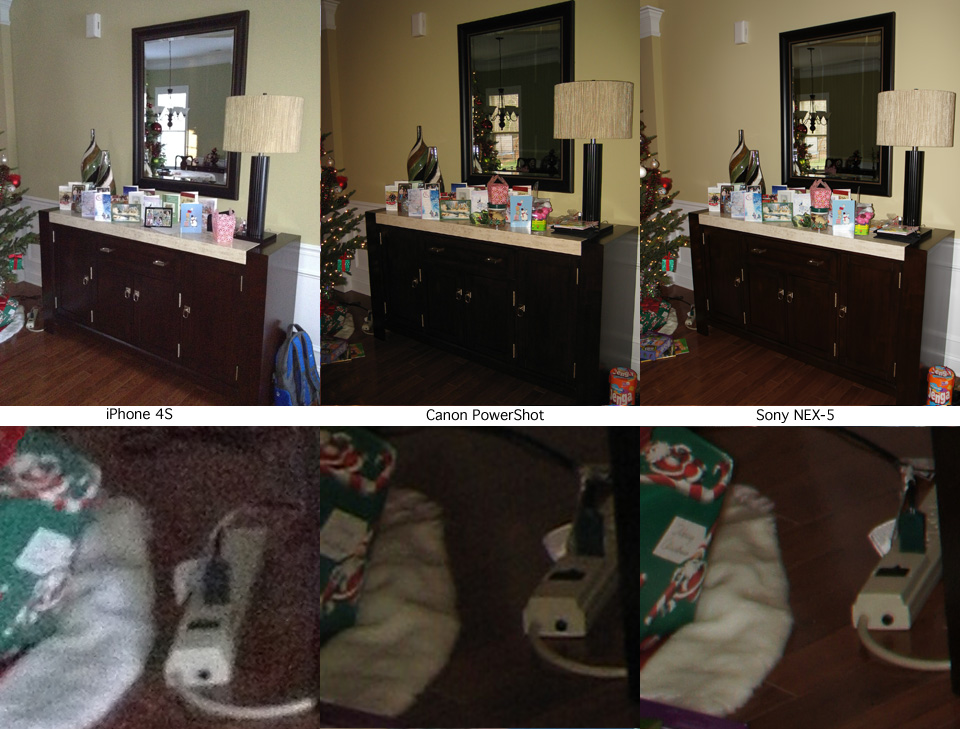

<h2>The iPhone 4S - Megapixels aren't everything</h2>

<table width="960" border="0">
<tr>
<td>The iPhone 4S taughts an improved 8 megapixel digital camera. After reading some 
positive reviews, I was hoping it would suffice for general purpose family pictures.
It certainly would be convenient to have everything all-in-one. So I put it up to the 
test, comparing to our tiny old 3 megapixel Canon PowerShot that my wife has been 
using since 2005. I also compared it to my Sony NEX-5 which isn't really fair, but 
shows what an up-to-date digital camera can do.</td>
</tr>

<tr><td></td></tr>

<tr><td>

In medium light without a flash, the iPhone 4S does a pretty good job of capturing the 
picture. It seems to favor these natural light shots, avoiding its flash in all but the 
most dim conditions. This produces a more natural picture, but the sensor is grainy at these
higher ISO speeds - good for email and web but not for printing. Natural light is also not 
always ideal for pictures of people, yielding unflattering shadowing around facial features.

Meanwhile color balance and metering are very good. But it regularly uses shutter speeds around 
1/15s or 1/20s which is really not practical for hand-held pictures due to motion blur, 
worse if you are trying to take pictures of kids that never stand still. Meanwhile the 
old Canon just can't perform indoors without a flash due to its old sensor with limited
ISO capability.

</td></tr>

<tr><td></td></tr>

<tr><td>

When a flash is required the iPhone 4S really struggles while a cheap point-n-shoot 
digital camera has no problem. Don't expect to get any detail out of these images. 
Surprisingly, the camera didn't compensate for the flash with a faster shutter speed or
lower ISO, indicating just how feeble the flash really is.

<b>Bottom line:</b> the iPhone 4S has a good little camera as far as phones go, but is
no substitute for a dedicated digital camera.

</td></tr>
</table>

For more infomration, contact me at <a href="mailto:mike@mikeroda.com">mike@mikeroda.com</a>

